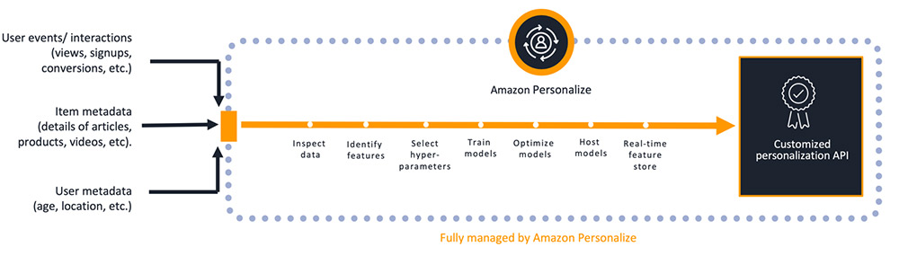
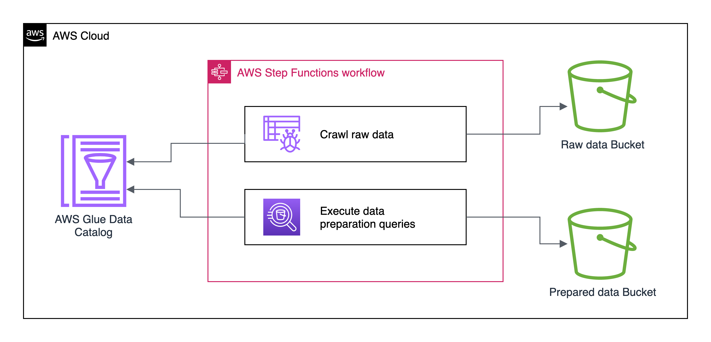
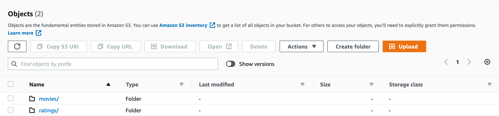
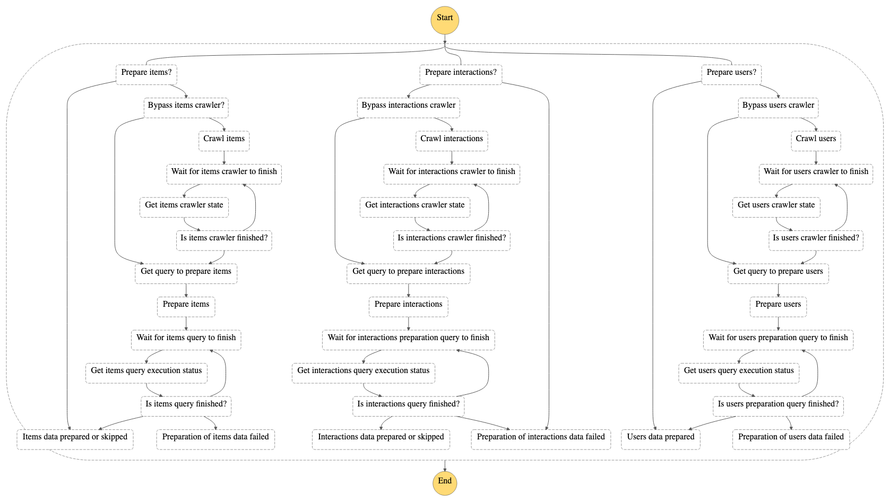

# 👋 Welcome to the Amazon Personalize kickstart

[](./CODE_OF_CONDUCT.md)
[](https://github.com/prettier/prettier)

---

[](https://codecov.io/gh/cremich/personalize-kickstart)

The goal of this repository is to provide you a kickstart for your personalization journey when building a recommendation engine based on Amazon Personalize.

It will serve you as a reference implementation you can both learn the concepts and integration aspects of Amazon Personalize. You can also use it to build you own recommendation engine upon best practices and production-ready components based on the [AWS CDK](https://aws.amazon.com/de/cdk/). Those components include:

- Ready to use [Amazon Sagemaker Notebook instances](#sagemaker-notebook-instance) for your data exploration, analysis and feature engineering tasks.

## 🪄 About Amazon Personalize

As part of the AI Services, Amazon Personalize is a managed service to provide personalization and recommendations based on the same technology used at Amazon.com. Using Amazon Personalize you will get convenient APIs you can use to solve a specific personalization and recommendation business problem.



Amazon Personalize is a fully managed service. It generates highly relevant recommendations using deep learning techniques. It build custom and private ML models using your own data.

## 🚀 Getting started

In order to install the backend on your local machine, please ensure to have the following tools available:

- AWS CLI v2
- node.js v14 (LTS)
- npm v6 (bundled with node.js)

### Installation

First install the required dependencies using `npm`.

```sh
npm install
```

This will install everything you need to deploy the backend and make changes to the code. It will also include all required dev-dependencies like ESLint, CommitLint or Jest.

Please also follow the ["Getting started"](https://docs.aws.amazon.com/cdk/latest/guide/getting_started.html#getting_started_prerequisites) instructions on the official AWS CDK documentation to configure your local workstation accordingly. Run the following command to verify correct installation and print the version number of the AWS CDK.

```shell
cdk --version
```

If you do not want to install the CDK globally, you can also execute it via `npx` like shown in the following examples.

Once you have installed the AWS CDK successfully, you can bootstrap your AWS Account by running

```shell
npx cdk bootstrap
```

### Useful commands

- `npm run build` compile typescript to js
- `npm run watch` watch for changes and compile
- `npm run test` perform the jest unit tests
- `cdk deploy` deploy this stack to your default AWS account/region
- `cdk diff` compare deployed stack with current state
- `cdk synth` emits the synthesized CloudFormation template

## 🎉 Usage

### Deploy your stack

In order to deploy your kickstart stack you simply have to execute a `cdk deploy` command. The CDK application follows a [multi stack approach](https://docs.aws.amazon.com/cdk/latest/guide/stack_how_to_create_multiple_stacks.html). You can choose if you want to provision a sandbox stack in your developer accounts or a shared stack in your central environment accounts like dev-, staging- or production accounts.

Here an example how to provision a sandbox account for a developer called bob.

```shell
cdk deploy personalize-bob --context sandbox=bob
```

If you want to deploy a shared development stack you can execute it like

```shell
cdk deploy personalize-dev
```

> 💡 Please change the stack setup in [personalize.ts](./bin/personalize.ts) to your needs and environment setup by adding your individual stacks.

## 🧱 Building Blocks

### Sagemaker Notebook

The Sagemaker-Notebook component provides an automatic provisioned Amazon Sagemaker Notebook for your data analysis and data exploration tasks. Provisioning a Sagemaker Notebook is optional and not required in all stages and cases. In central provisioned dev, staging or production accounts a Sagemaker Notebook is not inevitably necessary.

But it will help you in your developer sandbox accounts or stacks. Hence you can set some stack properties to control in which cases you need a provisioned Sagemaker Notebook and in which cases you don't need them:

```typescript
new PersonalizeStack(app, `personalize-${sandbox}`, {
  provisionSagemakerNotebook: true,
  notebookInstanceName: `personalize-${sandbox}`,
  notebookVolumeSizeInGb: 64,
});
```

### Data exploration notebook

We want to build a recommendation engine covering all features of Amazon Personalize. The dataset we will use is the publicly available MovieLens dataset.

> GroupLens Research has collected and made available rating data sets from the MovieLens web site (https://movielens.org). The data sets were collected over various periods of time, depending on the size of the set. Before using these data sets, please review their README files for the usage licenses and other details.

Source: https://grouplens.org/datasets/movielens/

The MovieLens dataset contains 25 million movie ratings and a rich set of movie metadata. We will use this data to provide an initial version of our recommendation engine based on historical data. Before you just import your historical data, it is recommended to gather knowledge. Both on your data and on your business domain.
Every recommendation engine project is kind of unique if we look at the data we have to process and the way the business works. In a very first step during a proof-of-concept phase, it is all about finding answers on:

- What data can we use?
- What data do we need?
- Is our data quality sufficient?
- How do we access the required data?
- How do we identify users, interaction or items we want to recommend?

The [data exploration notebook](./notebooks/data-exploration.ipynb) contains analyses both inspired from my personal experiences as well as a lot of cool stuff of the open source community like the following:

- [Analysis on the Movie Lens dataset using pandas](https://notebook.community/harishkrao/DSE200x/Mini%20Project/Analysis%20on%20the%20Movie%20Lens%20dataset)
- [Amazon Personalize immersion day](https://personalization-immersionday.workshop.aws/en/)
- [Analysis of MovieLens dataset (Beginner'sAnalysis)](https://www.kaggle.com/jneupane12/analysis-of-movielens-dataset-beginner-sanalysis)
- [Data Analysis using the MovieLens dataset with pandas](https://www.youtube.com/watch?v=8kElv1sticI)
- [Comprehensive Data Visualization with Matplotlib](https://towardsdatascience.com/comprehensive-data-explorations-with-matplotlib-a388be12a355)

### Data preparation

Amazon Personalize in general is easy to use. It offers you several APIs to get data in and get data out of Amazon Personalize. Personalize organizes your data into three containers - so called [Datasets](https://docs.aws.amazon.com/personalize/latest/dg/how-it-works-dataset-schema.html):

- Interactions,
- Items,
- Users

Each dataset is described by a schema that defines its structure in terms of fields, datatypes and additional metadata so that Amazon Personalize can interpret your data. Based from past experiences on several use cases it is likely that your raw data do not fit 100% to the required schema you define for your recommendation engine. This results in the need of preparing your data before your are able to import it into Amazon Personalize.

The complexity of the data preparation tasks and amount of work that is needed to prepare your data, differs from use case to use case. To prepare your data you have tons of options using several AWS services:

- You can setup a AWS Glue baked ETL pipeline.
- You can use AWS Glue DataBrew to normalize and transform your data.
- You can follow a streaming based approach by using a Kinesis Datastream with a AWS Lambda function as a consumer and import your data incrementally

A lot of options are on the table. In this project we start with a simple but efficient approach to prepare the movielens raw data using Amazon Athena. Our goal is to convert the movielens raw data into an Amazon Personalize schema compatible format. We can use these data for an initial model training using a bulk import. Amazon Personalize defines three requirements in order to be able to bulk import your data:

1. Your data must be in CSV Format
2. Your data must be readable via Amazon S3
3. The data must fit to the schema you have defined for your datasets.

Based on the simplicity of the movielens data, implementing this with Amazon Athena is very straight forward.



Our movielens raw data are available in our raw data bucket in Amazon S3. An AWS Glue crawler is connected to this bucket in order create an AWS Glue metadata catalog. The metadata catalog can then be queried using Amazon Athena. An Athena workgroup configures the results to be written in an Amazon S3 Bucket for your prepared data.

In order to automate the whole process of crawling and querying, all steps are baked into an AWS Step Functions state machine.

Each datasets - like movies or ratings - are persisted in separated folders inside the raw data bucket. This makes crawling the data much easier as we have separated data catalogs for ratings and movies. Raw data can [optionally be partitioned by date](https://docs.aws.amazon.com/glue/latest/dg/crawler-s3-folder-table-partition.html) for example.



According to our [data exploration](./notebooks/data-exploration.ipynb), movies data are mapped to our future items dataset and ratings will be the foundation for our interaction datasets. Hence we have two crawlers that are actively used in our data preparation workflow.

The solution also creates a crawler for users data but due to the absence of raw data for users, it is not used.

The whole process of crawling and preparing raw data is automate by a AWS Step Function state machine. The state machine orchestrates the data preparation for all three datasets while only the processing of interactions is required. Preparing item and user datasets is optional as they are not required by Amazon Personalize.



Crawling can be bypassed in each individual statemachine execution. In order to execute the statemachine, the following execution input parameters must be provided:

```json
{
  "interactionsPreparationQuery": "strin",
  "itemsPreparationQuery": "string",
  "usersPreparationQuery": "string",
  "itemsCrawlerName": "string",
  "interactionsCrawlerName": "string",
  "usersCrawlerName": "string",
  "bypassCrawler": "boolean"
}
```

Both the required ids of the named Athena queries as well as the name of the AWS Glue crawlers can be copied from the output section of the Cloudformation stack.

## 🤝 Contributing

Contributions, issues and feature requests are welcome!

Feel free to check [issues page](https://github.com/cremich/personalize-kickstart/issues) for open issues or create one for feature
requests or if you have general questions.

Be also sure to review our [contributing guidelines](./CONTRIBUTING.md) and [code of conduct](./CODE_OF_CONDUCT.md).
